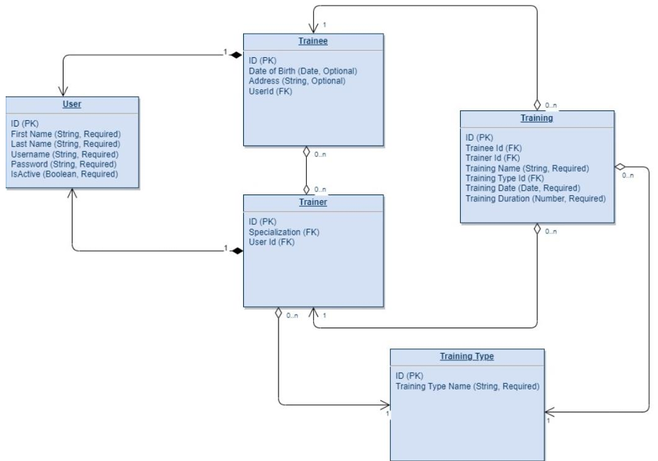

# Based on  
### a) the attached DB schema:

### b) on the codebase created during the previous module implement follow functionality:
1. Create Trainer profile.
2. Create Trainee profile.
3. Trainee username and password matching.
4. Trainer username and password matching.
5. Select Trainer profile by username.
6. Select Trainee profile by username.
7. Trainee password change.
8. Trainer password change.
9. Update trainer profile.
10. Update trainee profile.
11. Activate/De-activate trainee.
12. Activate/De-activate trainer.
13. Delete trainee profile by username.
14. Get Trainee Trainings List by trainee username and criteria (from date, to date, trainer
    name, training type).
15. Get Trainer Trainings List by trainer username and criteria (from date, to date, trainee
    name).
16. Add training.
17. Get trainers list that not assigned on trainee by trainee's username.
18. Update Tranee's trainers list  

## Notes:
1. During Create Trainer/Trainee profile username and password should be generated as
   described in previous module.
2. All functions except Create Trainer/Trainee profile. Should be executed only after
   Trainee/Trainer authentication (on this step should be checked username and password
   matching)
3. Pay attention on required field validation before Create/Update action execution.
4. Users Table has parent-child (one to one) relation with Trainer and Trainee tables.
5. Trainees and Trainers have many to many relations.
6. Activate/De-activate Trainee/Trainer profile not idempotent action.
7. Delete Trainee profile is hard deleting action and bring the cascade deletion of relevant
   trainings.
8. Training duration have a number type.
9. Training Date, Trainee Date of Birth have Date type.
10. Training related to Trainee and Trainer by FK.
11. Is Active field in Trainee/Trainer profile has Boolean type.
12. Training Types table include constant list of values and could not be updated from the
    application.
13. Each table has its own PK.
14. Try to imagine what are the reason behind the decision to save Training and Training
    Type tables separately with one-to-many relation.
15. Use transaction management to perform actions in a transaction where it necessary.
16. Configure Hibernate for work with DBMS that you choose.
17. Cover code with unit tests. Code should contain proper logging.

## Evaluation criteria
1. All functional tasks have been successfully executed per the requirements, with the application building and running error-free	60 points 
2. The written code adheres to clean code standards, development best practices such as SOLID, KISS, and DRY, utilizes design patterns, and maintains engineering excellence	10 points 
3. The code includes comprehensive logging, conforming to the best practices of logging; it includes various log levels, is sufficiently detailed, and does not contain sensitive data	10 points 
4. The code is covered by unit tests, achieving a line coverage of at least 80%. Additionally, these unit tests adhere to the FIRST principles	10 points 
5. Criteria specific to the task account for the remaining:
- Trainee information is accurately deleted using a cascade delete operation.
- Transactions are defined and used correctly.
- The relationships between entities are established correctly.
  10 points
